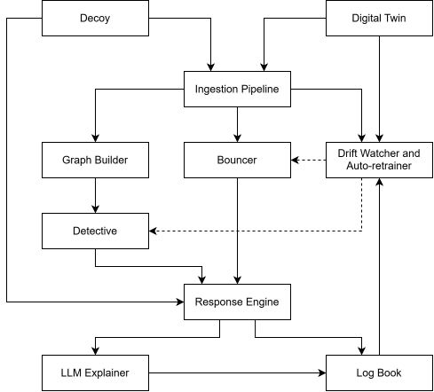

# KRONUS

**Knowledge-driven Response & Orchestration for Network Understanding and Security**

KRONUS is a network intrusion detection and automated response system built around eleven components across four tiers. It combines a fast statistical detection lane, a graph-based detection lane, and a deterministic honeypot signal with a policy-controlled response layer, an LLM incident explainer, and a self-healing production layer.

The system is designed around a simple principle: detection can be learned, but enforcement should remain bounded and auditable. Every automated response passes through the policy engine and circuit breaker, while model drift is monitored separately from enforcement.

The project is built around real NSL-KDD data, real protocol implementations, real policy evaluation, and an end-to-end runnable demo.

For measured results, implementation details, design rationale, and repository structure, see [`ABOUT.md`](ABOUT.md).

---

## Architecture



The system is organized into four tiers: Detection Core, Trust & Safety,
Intelligence, and Production Maturity.

### The four tiers

| Tier | Components | Purpose |
|---|---|---|
| **Detection Core** | Digital Twin, Ingestion Pipeline, Graph Builder, Bouncer, Detective, Decoy | Provides two analytical detection lanes and a deterministic honeypot signal |
| **Trust & Safety** | Response Engine, Logbook | Keeps automated actions bounded, reversible, and auditable |
| **Intelligence** | LLM Explainer | Produces a grounded incident explanation after enforcement |
| **Production Maturity** | Drift Watcher & Auto-Retrainer, Observability Stack | Monitors model quality and supports controlled retraining and promotion |

### Two detection lanes

The Bouncer reads the Event Stream directly and runs independently of graph construction. This keeps the fast path from being tied to the deep lane's snapshot cadence.

The Graph Builder and Detective form the deep lane. If both lanes produce a verdict for the same detection window, the Response Engine acts on the first verdict that clears the configured confidence threshold and records the later verdict without executing the response twice.

The Decoy follows the same policy path as the model-driven signals. Its confidence is fixed at 1.0 because any interaction with the honeypot is itself a security signal.

---

## Service Level Objectives

| SLO | Target | Mechanism |
|---|---|---|
| Decoy interaction → block (p95) | < 200 ms | Event, rule match, policy evaluation, enforcement |
| Fast-lane detect → block (p95) | < 400 ms | Direct Event Stream consumption by Bouncer |
| Deep-lane detect → block (p95) | < 3 s | ~2 s snapshot window plus CPU inference |
| Explanation latency (p95) | < 8 s | Asynchronous Job Queue; never gates enforcement |
| Sustained ingest throughput | 3,000–5,000 events/sec | Redpanda partitioning and HPA on consumer lag |
| Recall, known attacks (twin) | > 95% / class | Perfect twin labels and class-balanced training |
| External-dataset F1 | > 0.85 | CIC-IDS2017-compatible validation harness |
| False positive rate | < 2 / hour baseline | Calibrated threshold and staged rollout |
| Auto-block blast radius | 1 IP, 15-min TTL | OPA policy with automatic expiry |
| Action throttle | ≤ 20 actions/min/replica | Circuit breaker switches to alert-only |
| Pod recovery | < 30 s to ready, 0 event loss | Kubernetes probes and event-stream offset replay |
| Audit completeness | 100%, 0 broken hash links | Append-only hash-chained Logbook |
| Drift-to-retrain cycle | detect < 15 min, decide < 2 hrs | Drift Watcher, twin probes, and shadow evaluation |

These targets describe the intended operating envelope. The measured benchmark results are documented separately in [`ABOUT.md`](ABOUT.md).

---

## Quick start

```bash
pip install -r requirements-dev.txt
python scripts/download_data.py
python -m services.bouncer.train
python -m services.detective.train
python -m pytest tests/ -q
python -m demo.run_demo
```

The commands download the real NSL-KDD dataset, train both detection models, run the complete test suite, and launch the end-to-end demonstration.

For the full setup, including the OPA binary and optional PostgreSQL/Redpanda backends, see [`docs/setup.md`](docs/setup.md).

For operating the running system, see [`docs/instructions.md`](docs/instructions.md).

For frontend integration, see [`docs/frontend_guide.md`](docs/frontend_guide.md).

For full details on the independent ML experiments, data provenance, and benchmarking, see [`docs/experiments_guide.md`](docs/experiments_guide.md).

---

## ML Experiments

KRONUS provides six completely independent ML experiment pipelines with separate weights and metrics:

1. **Experiment A — Repo Data (NSL-KDD):**
   - Trains Bouncer and Detective independently using the NSL-KDD dataset already in the repository (`data/real/`).
   - Run command: `python scripts/run_repo_experiment.py`
   - Trained weights: `models/experiments/repo_data/bouncer/`, `models/experiments/repo_data/detective/`
   - Metrics: `results/experiments/repo_data_metrics.json` (Bouncer F1: 0.8179, Detective F1: 1.0000)

2. **Experiment B — CIC-IDS2017 (External Dataset):**
   - Trains Bouncer and Detective independently using the [CIC-IDS2017](https://www.unb.ca/cic/datasets/ids-2017.html) external network intrusion detection dataset from the University of New Brunswick.
   - **Data must be obtained separately** — see `docs/experiments_guide.md` for instructions.
   - Run command: `python scripts/run_cic_experiment.py` (aborts cleanly, with no fabricated metrics, if data is absent)
   - Trained weights: `models/experiments/cic_ids2017/bouncer/`, `models/experiments/cic_ids2017/detective/`
   - Metrics: `results/experiments/cic_ids2017_metrics.json` (Bouncer F1: 0.9987, Detective F1: 0.9846, 2,828,563 flows)
   - **Note:** CIC-IDS2017 is an external dataset evaluated through the KRONUS inference path. It is NOT synthetic and NOT renamed NSL-KDD data.

3. **Experiment C — UNSW-NB15 (External Dataset):**
   - Trains Bouncer and Detective independently using the [UNSW-NB15](https://research.unsw.edu.au/projects/unsw-nb15-dataset) external dataset from the Australian Centre for Cyber Security, UNSW Canberra.
   - Carries a genuine Reconnaissance class, so **both** KRONUS lanes train from one dataset: Bouncer on DoS-vs-normal, Detective on Reconnaissance-vs-normal.
   - **Data must be obtained separately** — see `docs/experiments_guide.md` for instructions.
   - Run command: `python scripts/run_unsw_nb15_experiment.py` (aborts cleanly, with no fabricated metrics, if data is absent)
   - Trained weights: `models/experiments/unsw_nb15/bouncer/`, `models/experiments/unsw_nb15/detective/`
   - Metrics: `results/experiments/unsw_nb15_metrics.json` (Bouncer F1: 0.9963, Detective F1: 1.0000, 257,673 flows)
   - **Honest disclosure:** the author-supplied pre-split CSVs carry no IP addresses, so hosts are reconstructed deterministically from each row's own connection-rate counters. Flow *features* are real; graph *topology* is reconstructed (`"synthetic_hosts": true` in the metrics).

4. **Experiment D — CIRA-CIC-DoHBrw-2020 (External Dataset):**
   - Trains the KRONUS **Detective** on DoH tunnel detection using the [CIRA-CIC-DoHBrw-2020](https://www.unb.ca/cic/datasets/dohbrw-2020.html) capture from the Canadian Institute for Cybersecurity, UNB.
   - **Detective-only, by design:** this dataset carries no DoS/flood traffic (every flow is benign DoH or a DNS tunnel), and the Bouncer's contract is strictly binary flood-vs-benign. Labelling tunnels as floods to make it train would be false, so the Bouncer is skipped and the metrics say so explicitly. This is the first experiment exercising the Detective's third class, `lateral_movement`.
   - **No reconstruction:** unlike Experiments A and C, this capture ships real IPs and real ports, so graph topology is the capture's own (`"synthetic_hosts": false`).
   - **Data must be obtained separately** — see `docs/experiments_guide.md` for instructions.
   - Run command: `python scripts/run_dohbrw2020_experiment.py` (aborts cleanly, with no fabricated metrics, if data is absent)
   - Trained weights: `models/experiments/dohbrw2020/detective/`
   - Metrics: `results/experiments/dohbrw2020_metrics.json` (Detective F1: 0.9697, 60,000 flows)

5. **Experiment E — CIC-Bell-DNS-EXF-2021 (External Dataset) — a deliberately negative result:**
   - Runs the KRONUS **Detective** end to end on [CIC-Bell-DNS-EXF-2021](https://www.unb.ca/cic/datasets/dns-exf-2021.html) (UNB/CIC), a DNS-exfiltration capture — then reports that the dataset cannot support a detection claim.
   - **Why it is negative:** the label is a capture-level annotation and is not recoverable from the features. Measured across all 536,138 rows: 72.78% sit on a feature vector carrying *two different labels*, including 99.95% of the exfiltration rows — a hard accuracy ceiling of **0.8210** for any model, below this repo's own F1 > 0.85 SLO. Removing the ambiguous vectors leaves the attack class with 32 distinct signatures, so the experiment records `verdict: NO_VALID_DETECTION_METRIC` and `reportable_as_detection: false` rather than quoting the 1.0000 its smoke test scores. A perfect score over 34 windows containing one positive example is a lookup table, not detection.
   - **Second, independent problem:** the dataset has **no IPs, no ports, no byte counts and no flow durations**, so every quantity the lanes consume is reconstructed (`"synthetic_hosts": true`, `"features_are_real": false`, with the derivation recorded in the metrics). Its one real discriminative signal, domain character entropy, reaches neither lane.
   - **Detective-only:** there is no flood traffic in this dataset, and the Bouncer's contract is strictly binary, so it is skipped and the metrics say so.
   - **Data must be obtained separately** — see `docs/experiments_guide.md` for instructions.
   - Run command: `python scripts/run_dnsexf2021_experiment.py` (aborts cleanly, with no fabricated metrics, if data is absent)
   - Trained weights: `models/experiments/dnsexf2021/detective/`
   - Metrics: `results/experiments/dnsexf2021_metrics.json` (Detective: **not reportable**, 46,398 flows loaded)

6. **Experiment F — CSE-CIC-IDS2018 (External Dataset) — both lanes train, one honest divergence:**
   - Trains **both** KRONUS lanes on [CSE-CIC-IDS2018](https://www.unb.ca/cic/datasets/ids-2018.html) (UNB/CIC, the successor to CIC-IDS2017) across four capture days: Bouncer on DoS/DDoS flood (Hulk, SlowHTTPTest, HOIC), Detective on `Infilteration` (Nmap sweep + full port scan).
   - **Bouncer F1 0.9925** (AUC 0.9994) on a stratified split. It also carries a leave-one-day-out block: fit on one flood day plus one benign day, score on the two days it has never seen. That gives F1 **0.9985 / 0.9977** when the unseen flood day is HOIC, and **0.8684 / 0.8681** when it is Hulk/SlowHTTPTest — with AUC still 0.988/0.993 in both. The ranking holds; the calibrated 0.5 threshold simply lands in the wrong place for a slower flood family. Stated in the metrics rather than smoothed over.
   - **Detective F1 0.3401 — below the repo's 0.85 SLO, and disclosed.** Rather than train first and explain afterwards, the runner measures the ceiling *before* training: a cross-validated linear probe over the same windows scores AUC **0.6017** / F1 0.4033. A cadence sweep (2s→120s) lifts AUC to 0.8518 while the attack/benign activity ratio stays flat at 1.20–1.30, so the gain is measurement precision on a constant ~25% difference, not a port-scan signature. Even at 120s, F1 0.6374 is still below SLO. `verdict: BOUNCER_REPORTABLE_DETECTIVE_BELOW_SLO`.
   - **The weak Detective score is not label noise.** 7.46% of rows sit on a feature vector carrying two classes, so the label is internally consistent — what separates `Infilteration` in this release lives in the 74 CICFlowMeter columns, and neither lane reads them (the Bouncer takes 6 rate features, the graph lane aggregates to 9 window statistics).
   - **The capture clock is real** — the first experiment here where it is, so windows are true 2-second slices rather than replaying rows at synthetic spacing. That matters to a rate-based lane: equal spacing makes `event_rate` constant by construction.
   - **Honest disclosure:** the ML-ready CSVs carry **no IPs and no source ports**, so hosts are reconstructed (`"synthetic_hosts": true`). Flow measurements are real, and `dest_ip` is a deterministic bijection of the **real** destination port — so the graph measures service fan-out, not host fan-out, and two of the four edge features are constant by construction. Recorded in the metrics.
   - Run command: `python scripts/run_cicids2018_experiment.py` (aborts cleanly, with no fabricated metrics, if data is absent)
   - Trained weights: `models/experiments/cicids2018/bouncer/`, `models/experiments/cicids2018/detective/`
   - Metrics: `results/experiments/cicids2018_metrics.json` (Bouncer F1: 0.9925, Detective F1: 0.3401, 32,777 graph windows)

7. **Experiment G — CIC-DDoS2019 (External Dataset) — Bouncer only, and a near-perfect score argued against itself:**
   - Trains the **Bouncer** on [CIC-DDoS2019](https://www.unb.ca/cic/datasets/ddos-2019.html) (UNB/CIC) across two capture days of reflection/amplification and direct volumetric floods (TFTP, SNMP, NetBIOS, SSDP, NTP, UDP, LDAP, MSSQL, Portmap, Syn, UDPLag, WebDDoS). The release contains no port-scan and no lateral-movement class, so the Detective does not train — the mirror image of Experiment D.
   - **Bouncer F1 0.9991** (AUC 0.9998, precision 1.0000) on a per-day stratified split, plus a leave-one-day-out block scoring **0.9992 / 0.9993** — no cross-day degradation at all.
   - **The near-perfect score is disclosed as a weak generalisation test, in the section itself.** Every attack row in the release comes from a **single host** (`172.16.0.5`), so the per-host 2-second window sees one extreme-rate source (median 273 events) against ordinary background traffic (0.5). A distributed flood from thousands of modest-rate sources is **not represented in this data**, and both days are captures of the same lab. The result confirms the rate-based feature set on the case it was designed for; it says nothing about distributed attacks.
   - **The pool ratio is disclosed too.** Benign is genuinely rare here (0.130% / 0.280%), so flood is capped at 6,000 rows per day for a 3.6:1 pool. Precision is exactly 1.0000 because the model made **zero false positives across 1,097 benign test windows** — not a false-positive rate measured over millions.
   - **Two data facts were measured rather than assumed, and both corrected the code.** (1) `Inbound` was documented as a per-file constant; it is not — read as a classifier (`attack iff Inbound == 1`) it scores **99.3–99.98%**, so it is the label in disguise and its exclusion was right for a reason the comment had wrong. (2) The victim host (`192.168.50.1` on 01-12, `192.168.50.4` on 03-11) appears as a source on both attack and benign rows, so the runner **drops those rows** (0.66% of benign) instead of claiming no benign window contains flood traffic — and counts the drop in the metrics.
   - **Honest disclosure on completeness:** the publisher gates these archives behind a registration form (no credentials are committed — they come from flags or env vars) and its stream is not resumable. `CSV-01-12.zip` here is a salvage of an interrupted download and holds **8 members**, not the full day; the per-day `raw_labels` census in the metrics shows exactly which families were trained on. `CSV-03-11.zip` downloaded complete.
   - Run command: `python scripts/run_cicddos2019_experiment.py --stride 32 --bouncer-limit 6000` (aborts cleanly, with no fabricated metrics, if data is absent)
   - Trained weights: `models/experiments/cicddos2019/bouncer/`
   - Metrics: `results/experiments/cicddos2019_metrics.json` (Bouncer F1: 0.9991, 1,821,283 rows loaded at stride 32)

---

## Production readiness

KRONUS is currently a laptop-scale, portfolio-scoped implementation rather than a production deployment. The core detection and response path runs as a single process, while the service boundaries are already separated under `services/` to support a future per-component deployment.

The current implementation uses CPU-based autoscaling rather than true per-lane consumer-lag scaling. The Detective's headline metric also has a deliberately narrow real-data scope. These limitations are documented rather than presented as production capabilities.

The intended production topology is documented separately in `infra/helm/kronus/values.yaml`.

---

## License

MIT — see [`LICENSE`](LICENSE).
